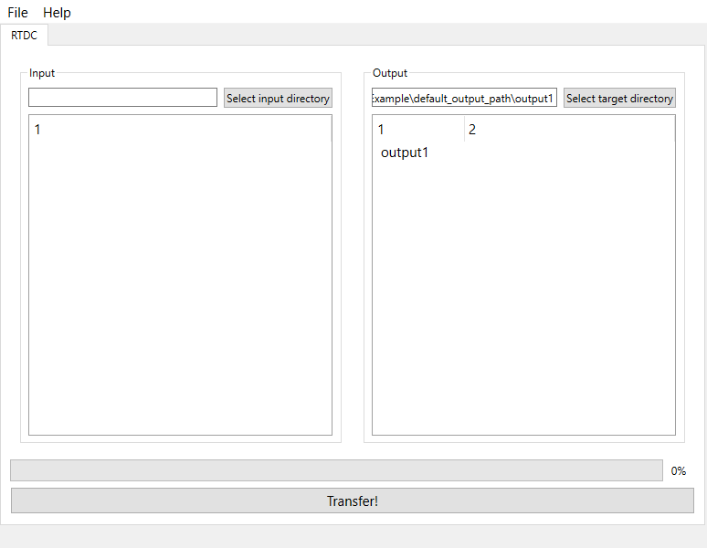

.. _sec_gui:

Graphical user interface (GUI)
==============================

The GUI is an easy to use way to use MPL-Data-Cast. The main window consists
of a tab for data of each experiment type, like, e. g. RT-DC.

On the left, you can specifiy the input directory, either by drag-and-drop of
a folder or by using the "Select input directory" button.
You can also drag-and-drop a file, in that case, the parent directory of that
file will be used internally. On the right, the output directory is shown, it
can be changed in the same way as the input directory.

For convenience, the default output directory can be changed in the settings.

The two big white areas will show the contents of input and output directory
respectively. Since large directories with many subdirectories can cause
performance issues, one can change the maximum depth of directories that should
be displayed here. The minimum is 2 and the maximum is 24.

The button at the bottom of the window starts the transfer of data using
the RT-DC recipe. The progress bar indicates the current status of the file
transfer and is updated after each file that was processed.
